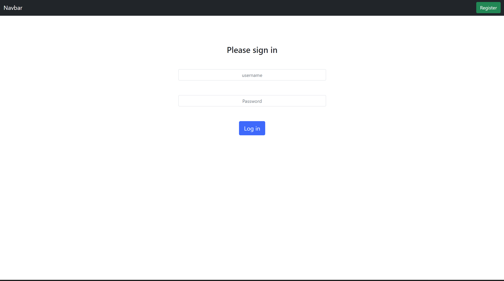

# simple-Inventory-app
This is a simple inventory management app can be used for keeping track of your items in kitchen,garage,etc

- There are 4 languages used in this project HTMl,CSS,Javascript and Python (for backend)

- Simple UI, theres no fancy ui woth many animations to ensure that it runs smoothly on every device

- Even encryption is inlcuded if you login with the username and password,password is safely stored using encryption library called bcrypt

- data is persistent that means even you end the program data is safely stored in the database so that next time you use the app you can continue from where you left
### To use
Download the source code and run "flask run" in your terminal
open the link printed in the terminal you will be directed to the login page 

### Login page

I can exclude the login page but additional security is always better

In the login page enter the username and password the click Log in

If you dont have an acoount you can always  create an account using the register button

### Register

To register you need to decide a username which is more than two letters and it should not be same username as others

Then enter the password for your account and retype the password for confirmation

Password should satisfy the conditions mentioned in the register page

### Home page

This is where you find all items added

There is even a search bar where you can find items as you type

In here if you want to log out just click log out and will return to the login page

There is a purple add button at the bottom right corner where you can add items to your inventory 

You can even delete items using the delete button

### Add 

This where you add items to your inventory 

Just add name of the item 

Then upload a image of the item(this is for future reference and will be helpful finding the item quicker)

Then add number of items you have of that item

Then simply click add,the item will be add to your inventory list and will be redirected to homepage
